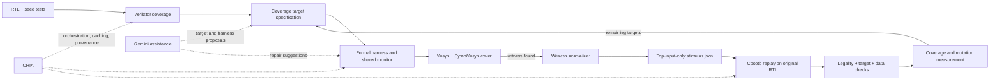

# Proof2Stim

## Formal-Witness-Guided Coverage Closure as Reusable CHIA Blocks

**Hackathon:** A³ CHIA Hackathon  
**Project status:** Proposal passed initial screening  
**Primary development environment:** Local Ubuntu laptop  
**Cloud budget requested:** **$850 USD total** ($300 initial credit + up to $550 additional funding)

---

## 1. Project Summary

Proof2Stim is an agentic RTL verification workflow that turns difficult coverage gaps into deterministic simulation tests. It combines:

1. Verilator coverage collection.
2. Coverage-target selection and formal-harness assistance using Gemini.
3. Bounded formal cover analysis with Yosys and SymbiYosys.
4. Formal-witness conversion into portable, deterministic stimulus.
5. Cocotb replay against the original, unmodified RTL.
6. Independent target and protocol checks before a generated test is accepted.
7. Reusable CHIA blocks that make the flow composable and cacheable.

The key idea is simple: an LLM can suggest what to verify and how to construct collateral, but formal tools and simulation decide whether the result is valid. A generated test is accepted only when the formal target is reached, the witness replays legally, the same target is observed in simulation, and measured coverage increases.

The initial vertical slice will use the open-source NVDLA `NV_NVDLA_apb2csb` bridge. After this flow works end to end, it will be evaluated on several additional small, control-oriented RTL blocks.

---

## 2. Proposal Document

### Overview

Proof2Stim is a reusable CHIA workflow for closing difficult RTL verification coverage gaps with formally generated witnesses. Given RTL, an existing cocotb regression, and Verilator coverage data, the system selects an uncovered semantic target, constructs a bounded formal cover problem, extracts a satisfying input trace, and converts that trace into a deterministic simulation test. The primary pilot will use the open-source NVDLA `NV_NVDLA_apb2csb` bridge, followed by three to five small RTL blocks with different control and handshake behaviors. The deliverable will be a set of reusable CHIA blocks for coverage analysis, formal-witness generation, trace conversion, and replay validation rather than a one-off test-generation script.

### Methodology

Each benchmark will have a pinned manifest containing its RTL revision, top module, clocks, resets, interface constraints, tool versions, and coverage targets. A baseline cocotb regression will first run with Verilator to collect line, toggle, and user-defined functional coverage.

A CHIA coverage-analysis block will convert selected gaps into machine-readable target specifications. Gemini will assist with interpreting RTL, proposing explicit environment assumptions, and repairing formal harnesses, but its output will not be trusted directly. A shared semantic target definition will be used by both the formal and simulation monitors so that the two stages measure the same behavior.

A formal block will use Yosys and SymbiYosys with an available SMT or SAT engine to solve bounded cover properties under explicit protocol and reset assumptions. Assumptions, safety assertions, and cover goals will remain separate. A successful cover result demonstrates that a target is reachable under the documented assumptions and within the selected bound. A bounded miss will be reported as unresolved, not incorrectly labeled unreachable.

The witness converter will retain only top-level DUT inputs, normalize unconstrained values deterministically, and emit a versioned JSON stimulus artifact. A cocotb replay block will generate clock and reset behavior, apply the trace to the unmodified RTL, and accept a test only if an independent legality checker passes and the same semantic target monitor fires in Verilator. Accepted tests will be added to the regression and coverage will be measured again.

Evaluation will compare Proof2Stim with time-matched constrained-random testing and Gemini-only direct test generation. Where tool compatibility permits, MCY mutation testing will evaluate whether added coverage also detects injected faults. Every run will record runtime, solver outcome, replay outcome, model usage, compute usage, and estimated cost. If enough accepted examples are accumulated and an NVIDIA GPU becomes available, a small QLoRA experiment may be evaluated as a stretch goal; the core result will not depend on fine-tuning.

### Expected Results

The project will produce containerized, independently reusable CHIA blocks; benchmark manifests; formal harnesses; deterministic witness artifacts; cocotb regression tests; and a reproducible evaluation report. The intended evaluation set is four to six RTL blocks and approximately 20 to 40 initially uncovered semantic targets.

The experimental goals are:

- Correctly replay at least 90% of successful formal witnesses.
- Close at least 70% of targets for which a bounded witness is found.
- Improve applicable Verilator coverage metrics by approximately 10 to 20 percentage points over the starting regressions.
- Show a measurable mutation-score improvement where MCY is compatible.
- Reproduce accepted stimulus and result hashes from the same pinned inputs.

These values are evaluation targets, not assumed outcomes. Results will separately report target-selection success, formal cover success, replay success, actual coverage delta, mutation score, runtime, cost, and failure category.

### Cost Estimate

| Compute category | Spending cap |
|---|---:|
| Vertex AI Gemini usage for RTL analysis, target generation, harness repair, and repeated experiments | $420 |
| GCP CPU/high-memory compute for parallel Verilator, Yosys, SymbiYosys, solver, and CHIA runs | $400 |
| Artifact storage, logs, and coverage-result retention | $30 |
| **Total estimated compute cost requested** | **$850 USD** |

Spending will be staged. The initial $300 credit will be used first, with local Ubuntu compute preferred wherever practical. Additional funding will be requested only after measurable progress and will not exceed $550. Each cloud category is a cap, not a requirement to spend the full amount.

---

## 3. Problem and Hypothesis

### Problem

Coverage closure is expensive because the remaining gaps often require long, precisely ordered protocol sequences. An LLM can generate plausible tests or properties, but plausible output is not sufficient for verification. Generated collateral can contain illegal assumptions, drive internal signals, misunderstand timing, or appear to pass without exercising the intended behavior.

### Hypothesis

An agentic flow will be more reliable when it uses formal cover witnesses as executable plans and simulation as an independent acceptance gate. This should outperform direct LLM test generation on selected control-flow targets because:

- The solver searches for a concrete bounded path to the target.
- Every environment assumption is explicit and reviewable.
- The witness is replayed on the original RTL rather than a modified model.
- A shared semantic monitor confirms that formal and simulation reached the same behavior.
- Coverage and mutation results measure value rather than trusting generated text.

### What this project does not claim

- A bounded cover miss does not prove a target unreachable.
- A cover witness is not proof that the environment assumptions are realistic.
- Higher structural coverage alone is not proof of better bug detection.
- Gemini output is not a verification oracle.
- The initial vertical slice is a plumbing demonstration, not the final benchmark result.
- GPU fine-tuning is optional and is not required for the core system.

---

## 4. System Architecture



### Planned reusable CHIA blocks

1. **Coverage Analysis**
   - Input: benchmark manifest, RTL hash, seed regression, coverage database.
   - Output: normalized coverage summary and candidate target specifications.

2. **Formal Cover Generation**
   - Input: RTL, interface manifest, selected target, prompt/model configuration.
   - Output: formal harness, assumptions, assertions, cover property, and validation report.

3. **Formal Solve**
   - Input: pinned formal problem, solver, depth, and timeout.
   - Output: `hit`, `bounded_miss`, `timeout`, `assertion_failure`, or `tool_error`, plus witness and logs when applicable.

4. **Witness Normalization**
   - Input: solver witness and signal manifest.
   - Output: schema-validated, deterministic, top-input-only `stimulus.json`.

5. **Replay Validation**
   - Input: original RTL, normalized stimulus, independent monitor, and legality checker.
   - Output: pass/fail status, target hit, observed values, artifact hashes, and coverage delta.

Each block should have explicit inputs and outputs, deterministic cache keys, timeouts, machine-readable failure states, and no hidden dependency on previous interactive state.

---

## 5. Initial Vertical Slice

### Pilot DUT

- **Repository:** [NVDLA hardware](https://github.com/nvdla/hw)
- **Module:** `vmod/nvdla/apb2csb/NV_NVDLA_apb2csb.v`
- **Top module:** `NV_NVDLA_apb2csb`
- **Clock:** `pclk`
- **Reset:** `prstn`, asynchronous and active low
- **Reason for selection:** Small, dependency-light bridge with meaningful APB/CSB handshake and delayed-response behavior.

The upstream repository commit, source hash, and license must be recorded before experiments. The third-party DUT must remain unmodified.

### First semantic target

Exercise a legal delayed APB-read round trip:

1. A legal APB read access is presented.
2. The outbound CSB request is stalled for at least one cycle.
3. The CSB request is accepted.
4. The APB transfer remains waiting while no CSB response is present.
5. The bridge does not issue a duplicate request while a read is outstanding.
6. A single delayed CSB response arrives.
7. The APB transfer completes and returns the response data.

This target intentionally exercises the bridge state used to suppress duplicate read requests while waiting for a response.

### Explicit environment assumptions

The formal harness must state these assumptions rather than silently relying on them:

- `penable` implies `psel`.
- An APB access phase is preceded by a setup phase or is a continuation of a waiting access.
- APB address, write direction, and write data remain stable while `psel && penable && !pready`.
- The selected address is word aligned and lies within the modeled range.
- CSB ready may vary arbitrarily.
- A CSB response occurs only when a read request is outstanding.
- Each accepted read produces at most one response pulse.
- Writes do not create read responses.
- A read response does not occur in the same cycle as request acceptance.

The last item is an integration assumption for this bridge target. It must not be described as a universal theorem of the CSB protocol.

### Assertions kept separate from the cover goal

- APB address, write data, and direction map correctly to the CSB request.
- `csb2nvdla_nposted` has the expected value.
- A write completes only according to the modeled ready behavior.
- A read completes only in response to the modeled return-valid behavior.
- No duplicate read request is accepted while a read is outstanding.
- At most one read is outstanding in this pilot environment.
- Returned APB data matches the accepted CSB response data.

Start with a bounded cover depth of 32 cycles and report timeouts or misses as unresolved.

### Witness artifact rules

The normalized witness must:

- Contain only top-level DUT inputs, excluding generated clock and reset waveforms.
- Never drive DUT outputs or internal state.
- Record signal widths and cycle numbers.
- Resolve unknown or unconstrained bits using a documented deterministic policy, initially zero-filling them.
- Preserve a known-bit mask so normalization remains auditable.
- Record the RTL commit/hash, target ID, formal depth, solver, and source witness hash.
- Use a versioned JSON schema.

### Binary success criteria for the vertical slice

The slice is complete only when all of the following are true:

- [ ] The pinned, unmodified DUT elaborates successfully in Verilator and Yosys.
- [ ] Deterministic baseline tests pass while the selected target remains measurably uncovered.
- [ ] SymbiYosys reaches the shared cover target within the documented bound.
- [ ] Safety assertions pass independently under the documented assumptions.
- [ ] A formal witness is saved.
- [ ] The converter emits schema-valid, top-input-only `stimulus.json`.
- [ ] An independent legality checker accepts the replayed trace.
- [ ] Cocotb replay on the original RTL fires the same semantic target monitor.
- [ ] Returned data and handshake behavior match expectations.
- [ ] The accepted generated test produces a positive, attributable coverage delta.
- [ ] Two clean reruns produce matching stimulus and result hashes.
- [ ] The complete local smoke run finishes in approximately one minute or less after the environment is built.

The baseline should intentionally omit the target-specific delayed-read sequence. A manually written version of that sequence must not be counted as generated coverage closure.

---

## 6. Implementation Phases

### Phase 0 — Reproducibility and bookkeeping

- [ ] Create the repository structure.
- [ ] Pin the CHIA commit and all verification-tool versions.
- [ ] Pin the NVDLA commit and preserve its license.
- [ ] Add a benchmark manifest for `NV_NVDLA_apb2csb`.
- [ ] Add a dependency doctor/smoke command.
- [ ] Add experiment, decision, and cost logs.
- [ ] Ignore credentials, raw coverage databases, build trees, large waveforms, and redundant logs.

### Phase 1 — Deterministic simulation baseline

- [ ] Elaborate the unmodified module in Verilator.
- [ ] Build cocotb clock and reset helpers.
- [ ] Build an APB requester and CSB responder.
- [ ] Add reset and write-path smoke tests.
- [ ] Collect deterministic Verilator line and toggle coverage.
- [ ] Implement the semantic target monitor independently of the DUT.
- [ ] Confirm that the selected delayed-read target is absent from the baseline.

This deliberately simple baseline proves the measurement and replay plumbing. Harder coverage targets are added during evaluation.

### Phase 2 — Formal target and witness

- [ ] Elaborate the same unmodified RTL in Yosys.
- [ ] Create a formal wrapper and protocol assumptions.
- [ ] Implement the same semantic target as a cover monitor.
- [ ] Add safety assertions separately.
- [ ] Run bounded cover at depth 32.
- [ ] Save solver status, logs, witness, runtime, and versions.

### Phase 3 — Witness conversion and replay

- [ ] Define and validate the `stimulus.json` schema.
- [ ] Extract top-level input values from the witness.
- [ ] Normalize unknown values deterministically.
- [ ] Replay with clock and reset generated by cocotb.
- [ ] Run independent legality, target, and data checks.
- [ ] Measure the before/after coverage delta.
- [ ] Repeat twice from a clean state and compare hashes.

### Phase 4 — CHIA integration and Gemini assistance

- [ ] First expose the verified deterministic stages as local functions or command-line entry points.
- [ ] Wrap coverage analysis, formal solve, witness conversion, and replay as reusable CHIA nodes.
- [ ] Demonstrate a successful second run using valid cached artifacts.
- [ ] Add Gemini only after the deterministic path is stable.
- [ ] Use Gemini for target interpretation and harness proposals, never final acceptance.
- [ ] Record model name, prompt version, parameters, token usage, latency, and estimated cost.

### Phase 5 — Benchmark evaluation

- [ ] Select three to five additional small, control-oriented open-source RTL blocks.
- [ ] Record selection criteria before seeing final results.
- [ ] Freeze prompts, seeds, bounds, timeouts, and per-target budgets.
- [ ] Compare Proof2Stim with time-matched constrained-random stimulus.
- [ ] Compare with Gemini-only direct test generation.
- [ ] Run MCY mutation analysis where compatible.
- [ ] Retain failed and timed-out runs.
- [ ] Produce aggregate and per-target result tables.

### Phase 6 — Final artifact and presentation

- [ ] Provide a one-command local smoke reproduction.
- [ ] Publish small example manifests, witnesses, generated tests, and result summaries.
- [ ] Document limitations and failure categories.
- [ ] Prepare an architecture diagram and short demo.
- [ ] Report actual runtime, compute efficiency, token usage, and total cost.
- [ ] Verify that the repository contains no secrets or private billing information.

---

## 7. Suggested Schedule

| Dates | Goal |
|---|---|
| September 2–4 | Complete the local NVDLA vertical slice through formal witness replay |
| September 5–8 | Wrap deterministic stages as CHIA nodes and add Gemini on one target |
| September 9–13 | Add benchmark DUTs, fixed baselines, and optional MCY evaluation |
| September 14–17 | Run frozen experiments and ablations; investigate failures without changing budgets silently |
| September 18–20 | Perform clean final runs, package artifacts, reconcile cost, and prepare submission/demo |

Fine-tuning should be attempted only if the core pipeline and benchmark harness are stable by September 13.

---

## 8. Evaluation Plan

### Primary metrics

| Metric | Definition |
|---|---|
| Target-selection success | Fraction of selected gaps converted into valid formal problems |
| Formal cover success | Fraction of formal targets with a witness within the bound and timeout |
| Replay success | Fraction of found witnesses that legally replay and hit the same target |
| Coverage closure | Fraction of selected targets newly covered after accepted replay |
| Coverage delta | Before/after line, toggle, and defined functional-target coverage |
| Mutation score | Fraction of injected mutations detected, where MCY is compatible |
| Determinism | Whether repeated clean runs produce matching normalized artifacts and outcomes |
| Runtime | Wall-clock time per stage and per target |
| Cost | Gemini and cloud-compute cost per attempted and successfully closed target |

### Baselines

1. **Seed regression:** The original deterministic tests.
2. **Time-matched constrained random:** Same wall-clock or simulation budget as Proof2Stim.
3. **Gemini-only direct generation:** Same target context and a fixed model-call budget, but no formal witness.
4. **Proof2Stim:** Gemini-assisted target/harness generation, bounded formal witness, deterministic replay, and validation.

### Required failure categories

- Target specification invalid.
- Formal elaboration failure.
- Assertion failure.
- Bounded miss.
- Solver timeout.
- Witness parsing failure.
- Illegal replay stimulus.
- Formal/simulation semantic mismatch.
- Target hit without coverage improvement.
- Tool or infrastructure error.

Failures must remain in the reported denominator appropriate to their stage. They must not be silently retried with looser rules and then reported only as successes.

---

## 9. Reproducibility and Artifact Contract

Every run should have an immutable run ID and record:

- Git commit and whether the working tree was dirty.
- DUT upstream commit, path, source hash, and license.
- Target specification version and hash.
- Tool, solver, Python, Ray, CHIA, and container versions.
- Seed, formal depth, timeout, and model settings.
- Machine or cloud instance description.
- Start time, end time, runtime, and exit status.
- Input, output, witness, stimulus, and result hashes.
- Token usage and estimated/finalized cost when applicable.

Commit compact manifests, schemas, accepted small witnesses, generated tests, and result summaries. Do not commit credentials, billing account IDs, large build products, raw redundant logs, full coverage databases, or unnecessary waveforms.

### Suggested repository structure

```text
.
├── README.md
├── PROOF2STIM_PROJECT_BRIEF.md
├── pyproject.toml
├── Makefile
├── versions.lock
├── containers/
├── manifests/
│   └── nvdla_apb2csb.yaml
├── third_party/
│   └── nvdla/
├── proof2stim/
│   ├── coverage/
│   ├── formal/
│   ├── targets/
│   ├── witness/
│   ├── replay/
│   └── chia_nodes/
├── verification/
│   └── nvdla_apb2csb/
│       ├── cocotb/
│       └── formal/
├── schemas/
├── scripts/
├── tests/
├── results/
└── runs/
```

---

## 10. Cloud and Cost Rules

- Prefer the Ubuntu laptop for Verilator, Yosys, SymbiYosys, and small CHIA runs.
- Use a dedicated GCP project for hackathon activity.
- Stay on the GCP Free Trial unless there is a deliberate reason to upgrade.
- GCP budget alerts are notifications, not hard spending caps.
- Do not assume paid Gemini use in Google AI Studio consumes GCP welcome credit; use Vertex AI when Gemini usage must be billed through GCP.
- Do not rely on Free Trial GPU access. The core project is CPU-compatible.
- Do not create long-lived GPU instances, GKE clusters, managed notebooks, reserved resources, or static IPs for the pilot.
- Use Application Default Credentials or an attached workload identity; never commit service-account JSON keys.
- Estimate cost and set a timeout/call cap before each cloud experiment.
- Reconcile each paid run in a cost ledger immediately afterward.
- Do not treat the additional $550 as available until it is approved.

### Cost ledger fields

`date, run_id, provider, service, model_or_machine, region, runtime, input_tokens, output_tokens, estimated_usd, actual_usd, cumulative_usd, notes`

---

## 11. Risks and Mitigations

| Risk | Mitigation |
|---|---|
| Formal environment is overconstrained | Review every assumption, run independent assertions, and replay on the original RTL |
| Formal and simulation targets differ | Generate both monitors from one versioned semantic target or cross-test them |
| Witness contains unknown values | Preserve known masks and apply a deterministic documented normalization policy |
| Generated trace drives non-input signals | Enforce schema validation against the top-module port manifest |
| Coverage increases without useful checking | Add independent data checks and mutation testing where practical |
| LLM produces plausible but invalid collateral | Treat all model output as a proposal and gate it with tools |
| Solver does not find a witness | Report bounded miss or timeout as unresolved; do not claim unreachability |
| CHIA integration consumes too much time | Prove each stage locally first, then add thin CHIA wrappers |
| Benchmark scope grows too quickly | Finish the single-DUT vertical slice before adding more blocks |
| Fine-tuning distracts from the core result | Keep QLoRA as a stretch goal with a fixed go/no-go date |
| Cloud costs drift | Prefer local compute, use per-run caps, and maintain the ledger from day one |

---

## 12. Immediate Next Actions

1. Create or open the project repository on the Ubuntu laptop.
2. Place this file at the repository root.
3. Pin the official CHIA repository commit and verify its smallest local example.
4. Pin the NVDLA hardware repository commit and record the module license/source hash.
5. Create `manifests/nvdla_apb2csb.yaml` with clock, reset, ports, constraints, and target ID.
6. Verify the unmodified module with both Verilator and Yosys.
7. Build the reset/write-only cocotb baseline and record coverage.
8. Implement the shared delayed-read target monitor.
9. Build the formal harness and obtain the first bounded witness.
10. Normalize, replay, validate, and measure that witness before adding Gemini or additional DUTs.

The first meaningful milestone is not “the agent generated code.” It is: **a formally generated, top-input-only trace replays deterministically on the original RTL, reaches the same independently checked target, and creates a measured coverage increase.**

---

## 13. Weekly Checkpoint Notes

No funding checkpoint is required while the initial $300 is sufficient. When additional funding is needed, prepare:

- A five-sentence progress summary based only on completed evidence.
- The work-in-progress GitHub repository URL.
- Current coverage, witness-replay, runtime, and cost numbers.
- The exact additional amount requested, no more than $550.
- A specific plan for that amount.
- The GCP billing account ID in the checkpoint form only, never in the repository.

Suggested five-sentence structure:

1. State what now works end to end.
2. Give one concrete technical result with a reproducible artifact or metric.
3. Report current benchmark scope, runtime, and spend.
4. Describe the next experiment and its exit criterion.
5. State the requested amount and exactly how it will be used.

---

## 14. Reference Links

- [CHIA repository](https://github.com/ucb-bar/chia)
- [NVDLA hardware repository](https://github.com/nvdla/hw)
- [Pilot module: `NV_NVDLA_apb2csb.v`](https://github.com/nvdla/hw/blob/nvdlav1/vmod/nvdla/apb2csb/NV_NVDLA_apb2csb.v)
- [SymbiYosys documentation](https://symbiyosys.readthedocs.io/)
- [Yosys documentation](https://yosyshq.readthedocs.io/)
- [Verilator documentation](https://verilator.org/guide/latest/)
- [cocotb documentation](https://docs.cocotb.org/)

